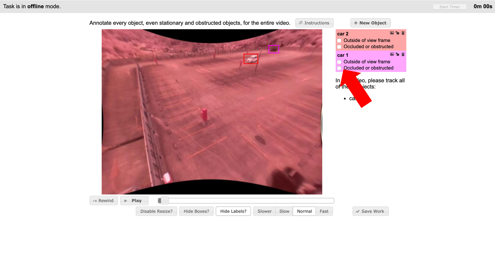

# M2Det_training_pipeline
## はじめに
オブジェクト検知で高いパフォーマンスを発揮するM2Detですが、オリジナルデータを使って学習させた例が少ないため、必要なワークフローをツールとともにここにまとめます。  
M2Detの実装は、 https://github.com/qijiezhao/M2Det をクローンしてビルドしてください。
## 環境
ローカルPC
* Mac OS Mojave 10.14.16
* python 3.6.8  
学習用サーバ
* CentOS
* CUDA V10.1.243
* cuDNN 7.6.3
* GeForce GTX 1080
## ワークフロー概観
1. データパッケージの構成
2. Vatic annotation toolによるアノテーション
3. データの水増しと必要ファイルの生成
4. サーバへのデータ転送
5. M2Det設定ファイルの変更
6. 学習スタート
## データパッケージの構成
データセットをローカルPCで作成し、zipファイルにまとめてサーバに送る運用を想定しています。  
このプロジェクト内では以下のようなディレクトリ構成にします。
```
root/
    ├ data/
    │
    ├ vatic_annotation/
    │    └ <data_name>/
    │         └ videos_in/
    │              └ <target_video>
    │
    └ generate_dataset.py
```
## Vatic annotation tool によるアノテーション
### インストール
以下の記事にしたがってDockerによる環境構築を行ってください。  
https://qiita.com/wakaba130/items/b0db5c5af4d1ecdaf985  
2019年9月10日現在、以下のスクリプトにミスがあるので、vimで修正してください。  
```
# cd root/vatic/
# vi cli.py

Line No.933, 934
file.write("<height>{0}</height>".format(video.width))
file.write("<width>{0}</width>".format(video.height))
>>
file.write("<height>{0}</height>".format(video.height))
file.write("<width>{0}</width>".format(video.width))
```
### アノテーション実行
rootティレクトリ直下で、以下のコマンドを実行してコンテナに入ります。
```
$ docker run -it -p 8111:80 -v $PWD/vatic_annotation/<data_name>:/root/vatic/data npsvisionlab/vatic-docker /bin/bash
```
上記のスクリプトミスを修正したのち、Qiita記事にしたがって実行スクリプトを走らせ、ブラウザで http://localhost:8111/directory/ に入ります。

画像の矢印で示した部分に、occlusion（対象が別のオブジェクトによって遮蔽されること）の有無を設定できるボタンがあります。  
事前に決定したルール（例えば対象の３割以上が遮蔽されていたらアノテーションしない）にしたがって、occlusionの有無を切り替えてください。  
occlusionをONにしている時にはバウンディングボックスが点線になりますが、追跡は継続されます。  
ここでOcclusionフラグを付与されたデータは、後続の処理によってデータセットから排除されます。
## データの水増しと必要ファイルの生成
root直下で以下を実行
```
$ python generate_dataset.py -i vatic_annotation/<data_name> -x 30 -y 30
```
すると、data以下が以下のような構成になります。
```
data/
    └ VOC<data_name>/
         ├ Annotations/
         │     ├ xxx0.xml
         │     ├ xxx1.xml
         │
         ├ ImageSets/
         │     ├ xxx0.jpg
         │     ├ xxx1.jpg
         │
         └ ImageSets/
               └ Main
                  ├ test.txt
                  └ trainval.txt

```
generate_dataset.py では、オプションで指定したpixel数だけ画像とラベルを上下左右に移動させることでデータを水増しし、同時にランダムにシャッフルして訓練データと検証データを生成します。
オプションはコードを参照してください。以下のレポジトリを参考に作成しています。  
https://github.com/ssaru/convert2Yolo
## サーバへのデータ転送
```
VOC<data_name>
```
をZipで圧縮して、サーバに転送します。FileZillaを使うと便利です。  
https://filezilla-project.org/  
サーバのM2Detプロジェクトは、ビルドしてVOCデータのダウンロードが終わっていれば以下のような構成になっているはずです。
```
root/
    ├ configs/
    │     ├ m2det512_vgg.py
    │
    ├ data/
    │     ├ VOCdevkit
    │
    │
    ├ train.py
```
圧縮したzipファイルは、data/VOCdevkit直下に転送して解凍します。
## M2Det設定ファイルの変更
m2det512_vgg.pyを修正します。モデルに関する基本的な設定は全てこのファイルに集約されているため、エポック数や学習率の設定変更もこのファイルをいじります。  
今回は自分のデータを指定するところまで設定します。
```python
# 64行目
# train_sets = [('2007', 'trainval'), ('2012', 'trainval')],
train_sets = [('<data_name>', 'trainval')],
```
## 学習スタート
```
CUDA_VISIBLE_DEVICES=2,3 screen python train.py -c=configs/m2det512_vgg.py --ngpu 2 -d VOC
```
GPUは使いたい番号を指定してください。  
screenコマンドはプロセスをバックグランドで回すために利用します。これをしておかないとサーバとのsshセッションが切れた時に学習がストップします。  
これで学習がスタートするはずです。お疲れ様でした。
## Tips
M2Detの学習は鬼のように時間がかかるため、放置して帰宅することが多いです。とはいえプロセスが生きているか心配なので、筆者はSlack botをtrain.pyに仕込んでいます。  
https://qiita.com/vmmhypervisor/items/18c99624a84df8b31008  
https://qiita.com/shtnkgm/items/4f0e4dcbb9eb52fdf316  
以上のサイトを参考に、train.pyにslackwebを導入します。save_weightsが終了したくらいのタイミングでメッセージ（例えば現在のエポック数）をPOSTするようにしておけば、Slackでプロセスの死活監視が可能になります。
## ファインチューニング
学習が終わったモデルに対して、別のデータを使って再学習を行うことができます。
```
CUDA_VISIBLE_DEVICES=2,3 screen python train.py -c=configs/m2det512_vgg.py --ngpu 2 -d VOC --resume_net weights/<model>.pth --resume_epoch 100
```
再学習を行う対象のモデル、およびどのエポックから再開するかを指定して実行します。  
learning rate (lr) に関するエラーが出る場合は、現在のepoch数に対応するlrの定義がされていない可能性があります。  
resume epochを小さくするか、設定ファイルのlrの定義を見直してください。